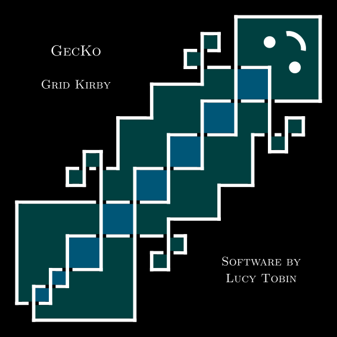

# GecKo
## Software for Random 3- and 4-Manifolds via Grid Kirby
### v0.1 2026-08-14



## Overview

This is a piece of software for generating random 3- and 4-manifolds as `Regina` triangulations. Grid diagrams are used to generate random framed links which are interpreted as Kirby diagrams, and an algorithm of Casali and Cristofori implemented by Burke as `Katie` is used to obtain a triangulation of the corresponding manifold(s).

The mathematics behind this is described in Chapter 5 of my PhD thesis:
> *Vertex Bounds, Complexity and Random Generation in 4-Manifold Topology* by Lucy Tobin (under review, available soon!)

- `/gecko`: the core functionality in `geckocore.h/.cc` (namespace `gecko`).
- `/katie`: a modified and expanded version of Rhuaidi Burke's [Katie](https://github.com/raburke/Comp4Top/) implemented as an importable header (namespace `katie`), see below for more information.
- `/mcmc`: a C++ implementation of Altmann and Spreer's [MCMCForTriangulations](https://github.com/jspreer/MCMCForTriangulations/) applied to simplifying 3-dimensional triangulations.
- `/generation-scripts`: command-line utilities for generating and saving samples of manifolds, and exhaustive enumeration.
- `/analysis-scripts`: command-line utilities for analysing saved data generated by the above and calculating topological types/invariants
- `/test-combined.cc`: test cases for the overall procedure
- `/demo.cc`: interactive demonstration which runs a single sample   **<==== START HERE ^_^**

## Compiling

Most of `GecKo` is written in `C++` (using `C++20`) which must be compiled against an installation of [Regina](https://github.com/regina-normal/regina). Some of the `/generation-scripts` require `Boost`, otherwise only standard `C++` libraries are used. The `Python` analysis scripts require `numpy` and `matplotlib`.


`geckocore.h/.cc`, `katie.h/.cc`, and `mcmc3.h/.cc` need to be compiled first, for the other utilities to be compiled against them. The exact specification will depend on your installation of `Regina`: you can use `Regina`'s own `regina-helper` utility to help with this. For an example on Linux, the process might look like:

```
$ g++ -c gecko/geckocore.cc -std=c++20 -I /usr/local/include/regina -lregina-engine -lgmp -o gecko/geckocore.o
$ g++ -c katie/katie.cc -std=c++20 -I /usr/local/include/regina -lregina-engine -lgmp -o katie/katie.o
$ g++ -c mcmc/mcmc3.cc -std=c++20 -I /usr/local/include/regina -lregina-engine -lgmp -o mcmc/mcmc3.o
```

Followed by

```
$ g++ demo.cc gecko/geckocore.o katie/katie.o -std=c++20 -I /usr/local/include/regina -lregina-engine -lgmp -o demo
$ g++ generation-scripts/sample3.cc gecko/geckocore.o katie/katie.o mcmc/mcmc3.o -std=c++20 -I /usr/local/include/regina -lregina-engine -lgmp -o generation-scripts/sample3
$ g++ katie/katie-cmd.cc katie/katie.o mcmc/mcmc3.o -std=c++20 -I /usr/local/include/regina -lregina-engine -lgmp -o katie/katie-cmd
...
```
and so on.

## Katie

This repo contains a modified version of `Katie` by Rhuaidi Burke. The major updates (from `Katie` as of 2025) are:

- now a set of callable functions `katie3` and `katie4` with an `#include`-able katie.h file
- can now deal with disconnected diagrams and perform gem connected sums
- can now output *oriented* `Regina` triangulations, correctly in the sense that the sign of the intersection form calculated by `Regina` matches the orientation from the diagram
- better pre-processing: now guarantees the result will be valid no matter how pathological the link diagram (as decribed in my thesis) and optimised the number of extra curls added
- separated the 3-manifold and 4-manifold versions to optimise in dimension 3, avoiding unnecessary added curls only needed in dimension 4
- highlighting procedure now simply highlights the whole way around the strand, avoiding some issues where not quite enough was highlighted

There is also a separate utility `katie-cmd` which recovers the original command line usage of `katie`, with the new functionality above.

## Coming Soon!

- Proper `Python` interface, for ease of use and compatibility with `GridPythonModule`, `Sage`, etc.
- Rework to a more modular setup, to allow easily plugging in other random link generators in place of grids.
- Better testing.
- "Big Red Button" graphical interface for the demo. 